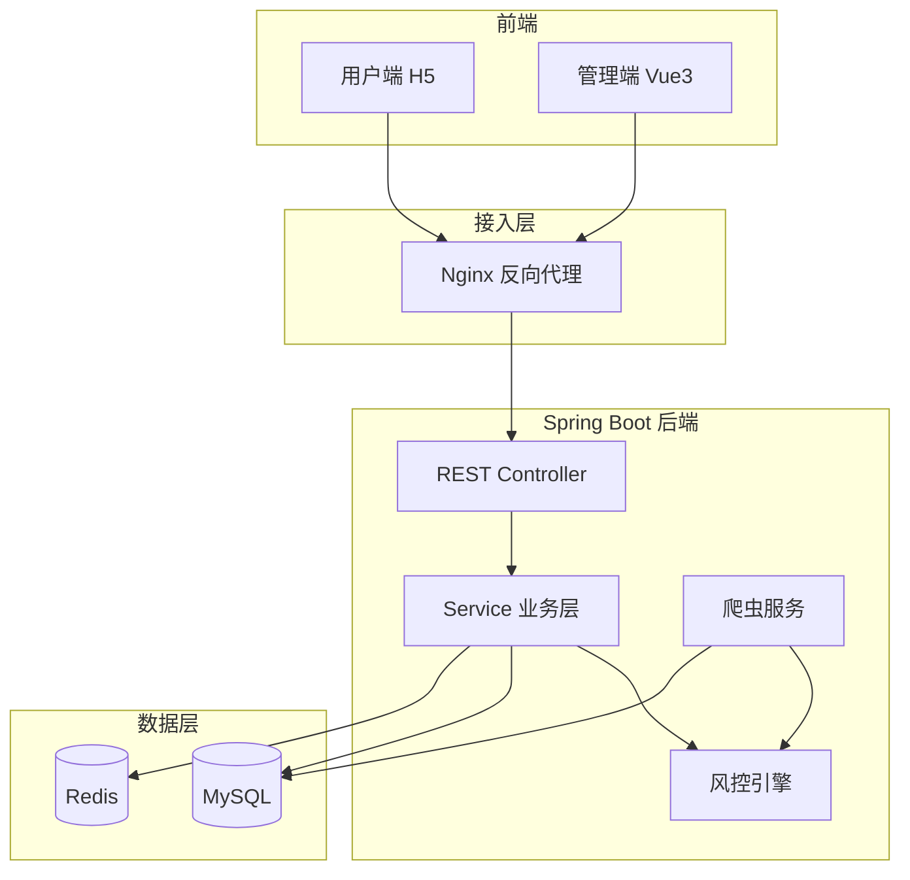

# 综设 II · 中期答辩报告（后端部分）

> 本文档为中期报告中「后端开发」对应章节，可与管理员前端、用户端前端、测试章节并列写入个人中期报告。进度按本学期中期（约 50%～55% 学期）评估，整体完成度约 **78%**。

---

## 第一章 综合项目的进展情况

### 1.1 针对工程问题的方案设计

后端是整个「多数据源融合的互联网个人贷款风控系统」的核心枢纽，负责承接用户端与管理端的全部业务请求，完成身份认证、贷款申请与审批、风控评估、合同与放款、还款计划与统计等能力。相比前端页面展示，后端更强调**业务规则正确性、数据一致性、安全边界与可扩展架构**，因此在设计阶段需要重点考虑模块划分、状态流转、多数据源融合方式以及部署运维。

#### （1）总体架构与模块划分

针对课程要求的「复杂软件工程问题」，后端采用 **Spring Boot 3.2.5 分层架构 + 按业务域分包** 的设计思路，将系统划分为以下模块：

| 模块包路径 | 职责 | 主要实体/表 |
|-----------|------|------------|
| `modules/auth` | 管理员登录、JWT 签发 | `admins` |
| `modules/user` | 用户注册、登录、资料 | `users` |
| `modules/loanapplication` | 贷款申请、审批 | `loan_applications` |
| `modules/risk` | 风控评估、评分卡、信誉分 | `risk_reports` |
| `modules/crawler` | 外部数据爬取与缓存 | `t_external_data_cache` |
| `modules/repay` | 还款计划、还款流水、逾期 | `repay_plans`, `repayment_records` |
| `service`（合同） | 合同生成、签署、放款 | `contracts`, `disburse_records` |
| `modules/product` | 贷款产品维护 | `products` |
| `modules/statistics` | 控制台统计与图表数据 | — |
| `modules/settings` | 门户配置 | — |
| `common/config` | 安全、初始化、异常处理 | — |

总体架构如下：



#### （2）多数据源融合方案（详细设计要点）

**工程问题：** 风控不能仅依赖库内信用分，还需融合征信、运营商等外部特征，且各数据源接口形态不一、课程环境无法直连生产 API。

**方案比选：**

| 方案 | 优点 | 缺点 | 结论 |
|------|------|------|------|
| 硬编码 IF-ELSE | 实现快 | 不可扩展、难演示「多源融合」 | 不采用 |
| **适配器 + 特征快照 + 爬取缓存** | 可扩展、可答辩演示、可替换真实 API | 需设计缓存与兜底 | **采用** |
| 微服务拆分数据源 | 解耦好 | 课程规模过重 | 不采用 |

**选定方案：**

1. 定义 `ExternalDataSourceAdapter` 统一接口，实现 `MockCreditBureauAdapter`（征信）、`MockTelecomAdapter`（运营商）；
2. `FeatureContextService` 并发拉取各适配器，汇总为 `FeatureSnapshot`；
3. `DataCrawlerService` 使用 Jsoup 解析演示 HTML 表格，写入 `t_external_data_cache`；
4. 适配器**优先读缓存**，无缓存时使用身份证/手机末位规则兜底。

数据流：

```
演示 HTML / HTTP 页面
    → Jsoup 解析 table
    → ExternalDataCacheService.save()
    → MockCreditBureauAdapter / MockTelecomAdapter.fetch()
    → FeatureSnapshot
    → SimpleScoringCardEngine + RiskRuleEvaluator 链
    → RiskReport 入库
```

#### （3）评分卡与规则链方案

**工程问题：** 任务书要求体现「模型化」风控，且答辩需可解释。

| 方案 | 说明 | 结论 |
|------|------|------|
| 纯规则引擎 | 阈值 IF-ELSE | 实现快，难以体现评分卡 |
| **评分卡 + 规则链** | 分箱计分 + 多评估器串联 | **选用** |
| 机器学习模型 | XGBoost 等 | 样本不足，中期不采用 |

**评分卡四维度（`SimpleScoringCardEngine`）：**

- 信用分分箱计分；
- 贷款金额分箱计分；
- 征信逾期次数（来自爬虫缓存）；
- 运营商在网月数（来自爬虫缓存）。

通过阈值：`risk.scoring-card.pass-min-points=40`（可配置）。

规则链由 Spring 自动注入所有 `RiskRuleEvaluator` 实现，按 `@Order` 优先级执行，包括：

- `BasicRiskRuleEvaluator`：信用分门槛、用户状态；
- `ScoringCardRiskEvaluator`：评分卡计分；
- `ExternalDataRiskEvaluator`：征信逾期硬性规则等。

#### （4）安全与接口设计

- **认证：** JWT（jjwt 0.12.5），`JwtAuthenticationFilter` 拦截 `/api/**`；
- **放行：** 登录、注册、Swagger、静态资源无需 Token；
- **配置外置：** 数据库、Redis、JWT 密钥、管理员密码通过环境变量注入，支持 Docker `.env`；
- **接口风格：** REST + 统一 `{ success, data, message }` 包装（部分列表接口）；
- **文档：** SpringDoc OpenAPI，访问 `/swagger-ui.html` 便于联调。

#### （5）部署方案

采用 **Docker Compose** 一键部署：`mysql` + `redis` + `backend` + `web(Nginx)`。Nginx 同源转发 `/api/` 至后端，用户 H5 与管理端共用域名，避免跨域与硬编码 API 地址。

---

### 1.2 针对工程问题的推理分析

#### （1）为何采用「提交申请时同步触发风控」

用户提交贷款申请是风控的 natural trigger。若在管理员审批后才评估，管理端列表会出现「风险未评估」、审批缺乏依据。因此在 `LoanApplicationServiceImpl.submitApplication()` 保存申请后立即调用 `riskService.performRiskAssessment()`，并将结果写入 `risk_reports`，管理端与用户端均可读取。

推理结论：**事件驱动时机前移**，保证审批员与用户看到的风控信息一致。

#### （2）为何还款计划在「审批通过」后生成，而非提交时

若在 `pending` 状态就生成还款计划，用户端会显示「尚未通过审批」的待还账单，违背业务常识。中期阶段已将 `createRepayPlans()` 从提交逻辑移至 `approveApplication()`，并在查询层过滤贷款状态（仅 `approved/disbursed/settled/paid` 可见）。

推理结论：**状态机与数据生成时机必须一致**，否则前后端都会出现「数据有了但业务不允许」的矛盾。

#### （3）为何用爬取 + 缓存而非直连征信 API

真实征信/运营商接口需资质与专网，课程环境不可行。推理路径为：演示 HTML 模拟外部页面 → Jsoup 解析 → 入库缓存 → 适配器消费。既满足任务书「数据爬取」要求，又通过 `ExternalDataSourceAdapter` 为后续替换真实 HTTP/SDK 预留扩展点。

#### （4）为何合同与放款独立成状态机

贷款申请状态：`pending → approved → disbursed → SETTLED`。合同状态：`PENDING_SIGN → SIGNED → DISBURSED`。推理依据：

- 审批通过只代表「准入」，不代表资金已放出；
- 签署与放款分步，便于管理端演示完整链路；
- `ContractServiceImpl.disburseContract()` 才将申请置为 `disbursed`，与用户端「已放款」展示对应。

#### （5）技术选型推理

| 技术 | 选型理由 |
|------|----------|
| Spring Boot 3.2 + Java 21 | 与课程栈一致，生态成熟 |
| Spring Data JPA | 快速建模，中期用 `ddl-auto=update` 降低迁移成本 |
| Redis | 预留会话/缓存扩展（已接入依赖） |
| MySQL 8 | 关系型数据、答辩可查表 |
| Jsoup | 轻量 HTML 解析，适合演示爬取 |
| JUnit5 + Mockito | Service 层可脱离数据库单测 |

---

### 1.3 针对工程问题的具体实现

截至中期阶段，后端核心模块已完成开发与前后端联调，**整体完成度约 78%**。主要环境与工具如下：

| 类别 | 选型 | 选择理由 |
|------|------|----------|
| 语言与运行时 | Java 21 | LTS，与 Spring Boot 3 官方支持一致 |
| 框架 | Spring Boot 3.2.5 | Web + JPA + Security + Validation 一站式 |
| 构建 | Maven 3.9 | 课程常用，便于 `mvn test` 与 Docker 多阶段构建 |
| 数据库 | MySQL 8.0 | 主业务持久化 |
| 缓存 | Redis 7 | 已配置，后续可承载热点数据 |
| 安全 | Spring Security + JWT | 无状态 API，适合前后端分离 |
| 爬虫 | Jsoup 1.17 | 解析演示 HTML 表格 |
| 文档 | SpringDoc | 自动生成 Swagger UI |
| 部署 | Docker Compose + Nginx | 云服务器一键演示 |

#### （1）认证与用户模块（完成度约 85%）

- 用户：`POST /api/users/register`、`/login`、`/login-otp`，JWT 返回 `token` + `userInfo`；
- 管理员：`POST /api/admin/login`，密码从环境变量 `ADMIN_PASSWORD` 读取（与数据库 `admins` 表解耦，便于 Docker 部署）；
- `SecurityConfig` 配置无状态会话，`/api/**` 除白名单外需 Bearer Token。

#### （2）贷款申请与审批模块（完成度约 85%）

- `POST /api/loan-applications/submit`：校验信用分 ≥ 450、用户状态正常，生成申请单号 `LA-{timestamp}`，**同步触发风控**；
- `PUT /api/loan-applications/{id}/approve|reject`：管理员审批，通过后 `createContractForApplication()` + `ensureRepayPlansForApplication()`；
- `GET /api/loan-applications`、`/user/{userId}`：列表与详情，DTO 含 `riskScore`、`riskPassed`、`scoringCardPoints`、`statusText` 等字段。

核心风控触发代码逻辑：

```java
// 保存申请后同步评估
loanApplicationRepository.save(application);
riskService.performRiskAssessment(application.getId());
```

#### （3）风控与评分卡模块（完成度约 80%）

- `RiskServiceImpl.performRiskAssessment()`：构建 `FeatureSnapshot` → 遍历 `RiskRuleEvaluator` → 写入 `RiskReport`；
- `SimpleScoringCardEngine`：四维度计分，返回 `ScoringCardOutcome`（总分、满分、分项 breakdown）；
- `GET /api/risk/applications/{id}/assessment`：查询评估结果；
- `CreditController`：`/api/credit/users/{userId}/evaluation` 支撑用户端额度页。

配置 excerpt（`application.properties`）：

```properties
risk.scoring-card.enabled=true
risk.scoring-card.pass-min-points=40
datasource.credit-bureau.enabled=true
datasource.telecom.enabled=true
```

#### （4）数据爬取模块（完成度约 75%）

- `DataCrawlerService.runFullCrawl()`：解析 `demo-credit.html`、`demo-telecom.html` 中表格行；
- 写入 `t_external_data_cache`，TTL 24 小时；
- `DataCrawlerScheduler`：启动后定时爬取；`POST /api/admin/crawler/run` 支持手动触发；
- `DataInitializer.backfillRiskReports()`：启动时为历史申请补全风控报告（演示数据）。

爬取核心逻辑示意：

```java
Document doc = loadDocument(creditUrl);
Elements rows = doc.select("table#credit-data tbody tr");
// 按 id_suffix 写入 credit_overdue_count、credit_query_count_30d
cacheService.save(DataSourceType.CREDIT_BUREAU.name(), "SUFFIX_" + suffix, "", payload, ...);
```

#### （5）合同与放款模块（完成度约 80%）

- 审批通过自动创建合同，状态 `PENDING_SIGN`；
- `PUT /api/admin/contracts/{id}/sign`：管理员签署；
- `PUT /api/admin/contracts/{id}/disburse`：放款并写 `disburse_records`，申请状态 → `disbursed`；
- 用户端 `PUT /api/contracts/{id}/sign`：用户签署（权限校验）。

#### （6）还款模块（完成度约 80%）

- 审批通过后生成多期 `RepayPlan`（等额本息/等额本金）；
- `GET /api/repayment/plans/user`：仅返回**已审批贷款**的待还/逾期计划；
- `POST /api/repayment/pay`：支持全额/部分还款，写 `repayment_records`；
- `RepaymentOverdueScheduler`：每日凌晨扫描逾期（`repay.overdue.cron`）。

#### （7）统计与产品模块（完成度约 75%）

- `StatisticsController`：`/api/statistics/dashboard`、`/charts`、`/recent-loans`；
- 月度还款统计按 `repayment_records.repay_time` 归集，排除未来月份；
- `ProductController`：产品 CRUD，供管理端维护。

#### （8）部署与运维（完成度约 70%）

- `deploy/docker-compose.yml`：四容器编排；
- `backend/Dockerfile`：Maven 多阶段构建，支持 `settings.xml` 阿里云镜像；
- `backend/Dockerfile.prebuilt`：本机打包 JAR 后快速部署备选方案。

**中期尚未完成：** 真实第三方 API 适配、Redis 业务缓存落地、部分统计指标仍为演示算法、接口级集成测试（RC/TC 用例）待开展。

---

### 1.4 知识技能学习情况

在本阶段后端开发中，主要学习与掌握了以下内容：

**1. Spring Boot 3 与分层架构**  
理解 Controller → Service → Repository 职责划分；使用 `@Transactional` 保证审批、放款、还款等写操作一致性；通过 `@RequiredArgsConstructor` + Lombok 简化依赖注入。

**2. Spring Security + JWT 无状态认证**  
学习 `SecurityFilterChain` 配置、白名单放行、JWT 解析与用户身份绑定；理解前后端分离下 Token 传递方式（`Authorization: Bearer`）。

**3. JPA 与实体建模**  
掌握 `@Entity`、`@ManyToOne` 关联、懒加载注意事项；使用 `ddl-auto=update` 快速迭代表结构；编写 `@Query` JPQL 实现按用户与贷款状态过滤还款计划。

**4. 设计模式实践**  
- **适配器模式：** `ExternalDataSourceAdapter` 屏蔽多数据源差异；  
- **策略模式：** `RiskRuleEvaluator`、`CreditScoreCalculator` 可插拔扩展；  
- **模板方法思想：** 风控评估固定「取特征 → 评估 → 落库」流程。

**5. 爬虫与数据融合**  
学习 Jsoup 的 `select` CSS 选择器解析 HTML 表格；理解「爬取 → 缓存 → 适配器 → 特征快照」流水线，而非在 Service 中硬编码外部数据。

**6. 定时任务**  
使用 `@Scheduled` 实现爬虫周期执行与还款逾期检测；通过 `@ConditionalOnProperty` 控制任务开关。

**7. Docker 与云部署**  
学习多阶段 Dockerfile、Compose 服务依赖（`depends_on` + healthcheck）、环境变量注入；排查 Maven 构建网络、CRLF 脚本、`.env` 解析等实际问题。

**8. 单元测试**  
配合测试同学，理解 JUnit5 + Mockito 对 Service 层隔离测试的方法（详见测试章节）。

**收获：** 后端开发不仅是「写接口」，还包括状态机设计、风控可解释性、配置外置、部署可复现，以及与双端前端的字段契约维护。

---

## 第二章 存在问题与解决方案

### 2.1 存在的主要问题

**第一，前后端字段与状态枚举不一致。**  
例如贷款状态存在 `approved`、`disbursed`、`SETTLED` 等多种写法，前端若未映射会显示英文或错误中文。统计接口 `recent-loans` 曾将 `disbursed` 误归并为 `pending`，导致控制台「最近贷款」与贷款管理页不一致。

**第二，演示数据与真实业务节奏交叉。**  
`DataInitializer` 注入跨月贷款/还款种子数据，若未补全 `risk_reports`，管理端显示「风险未评估」；种子数据含未来月份还款，曾导致统计图表出现异常柱形。

**第三，云服务器 Docker 构建环境不稳定。**  
`mvn package` 在容器内访问 Maven Central 失败（Network unreachable），backend 镜像构建耗时长（10～20 分钟），影响迭代效率。

**第四，还款计划生成时机曾不合理。**  
早期在申请提交时即生成计划，导致用户端在审批前即可看到待还账单；虽已调整为审批后生成，历史数据库中可能仍存在旧数据。

**第五，管理端缺少「一键爬取」入口。**  
爬虫接口 `POST /api/admin/crawler/run` 已实现，但管理端 Vue 未封装按钮，答辩演示需借助 Swagger 或 curl。

**第六，集成测试与风控专项测试未全面开展。**  
单元测试 13 条已通过，但 RC01～RC10、TC01～TC18 仍停留在用例设计阶段，全链路回归依赖手工。

**第七，配置与文档分散。**  
JWT、评分卡阈值、爬虫 URL 等分布在 `application.properties` 与 `.env`，新成员上手需同时阅读 `deploy/README.md` 与 Swagger。

### 2.2 解决方案

**针对字段与状态不一致：**  
在 `LoanApplicationDTO` 增加 `statusText` 由后端统一输出中文；管理端 `admin.js`、用户端 `loan-records.html` 建立完整状态映射表；`StatisticsServiceImpl` 与业务层共用同一套归一化逻辑。

**针对演示数据问题：**  
`backfillRiskReports()` 启动补全风控；还款种子仅生成至当前月；月度统计以 `repayTime` 为准并过滤未来月份。

**针对 Docker 构建：**  
增加 `backend/settings.xml` 阿里云镜像；提供 `Dockerfile.prebuilt` 本机打包 JAR 方案；文档补充排错步骤。

**针对还款计划：**  
审批通过时 `ensureRepayPlansForApplication()`；`RepayPlanRepository` 查询增加贷款状态过滤。

**针对爬虫演示：**  
后续在管理端增加「触发爬取」按钮；答辩脚本固定：先爬取 → 再提交申请 → 展示评分变化。

**针对测试：**  
按测试同学计划开展 RC 专项与 TC 全链路；后端配合修复接口问题并补充必要日志。

**针对配置：**  
整理「环境变量一览表」写入部署 README；敏感项仅通过 `.env` 注入，不提交仓库。

---

## 第三章 前期任务完成度与后续实施计划

### 3.1 前期任务完成度自我评价

截至中期，本人负责的后端部分整体完成度约 **78%**，可支撑答辩演示主流程：**注册登录 → 申请贷款 → 自动风控 → 管理员审批 → 合同签署放款 → 还款 → 控制台统计**。

| 模块 | 完成度 | 完成情况说明 |
|------|--------|--------------|
| 项目骨架与配置 | 90% | Spring Boot、JPA、Security、Swagger、日志 |
| 用户与管理员认证 | 85% | JWT、注册登录、权限拦截 |
| 贷款申请与审批 | 85% | 提交、审批、列表、风控联动 |
| 风控与评分卡 | 80% | 规则链、评分卡、报告入库 |
| 多数据源与爬虫 | 75% | 适配器、缓存、定时与手动爬取 |
| 合同与放款 | 80% | 生成、签署、放款状态机 |
| 还款与逾期 | 80% | 计划生成、还款、逾期任务 |
| 统计接口 | 75% | 控制台、图表、最近贷款 |
| 产品与设置 | 70% | 基础 CRUD |
| Docker 部署 | 70% | Compose 可用，构建优化进行中 |
| 单元测试配合 | 100% | 5 个测试类 13 用例已通过 |
| 集成/功能测试 | 30% | 用例已设计，执行待开展 |

**团队角色说明（请按实际填写姓名）：**  
在团队中担任 **后端负责人 / 架构与核心业务开发**，承担接口设计、风控与爬取模块实现、Docker 部署、与前后端联调支持；与测试同学配合完成 Service 层单测可测性改造。

### 3.2 后续实施计划

| 阶段 | 时间 | 主要任务 | 预期成果 |
|------|------|----------|----------|
| 第 1 周 | 后期 W1 | 修复联调遗留问题（状态同步、还款过滤） | 双端数据一致 |
| 第 2 周 | 后期 W2 | 管理端爬取按钮、统计指标核对 | 答辩演示脚本稳定 |
| 第 3 周 | 后期 W3 | RC 风控专项 + TC 全链路测试 | 测试报告可交付 |
| 第 4 周 | 后期 W4 | 部署文档、HTTPS 可选、性能粗测 | 验收环境稳定 |
| 答辩前 | — | 彩排完整链路、准备讲解风控与爬取 | 答辩顺利通过 |

**答辩演示建议流程（后端视角）：**

1. 展示 Swagger 或日志：提交申请 → 自动风控入库；  
2. Navicat 展示 `risk_reports`、`t_external_data_cache`；  
3. 触发爬虫后对比同一用户评分变化；  
4. 管理员审批 → 合同 → 放款 → 还款计划生成；  
5. 控制台统计与最近贷款状态一致。

---

## 参考文献（后端相关，可并入团队参考文献）

[1] Spring Team. Spring Boot Reference Documentation[EB/OL]. https://docs.spring.io/spring-boot/docs/current/reference/html/  
[2] OWASP. JSON Web Token (JWT) Cheat Sheet[EB/OL]. https://cheatsheetseries.owasp.org/cheatsheets/JSON_Web_Token_for_Java_Cheat_Sheet.html  
[3] 李刚. 疯狂 Java 讲义[M]. 电子工业出版社.  
[4] 萨师煊, 王珊. 数据库系统概论[M]. 高等教育出版社.  
[5] Jsoup. Jsoup Java HTML Parser Documentation[EB/OL]. https://jsoup.org/

---

*说明：请将「团队角色」中的姓名、完成度百分比按个人实际分工微调后，合并入正式中期报告 Word/PDF。*
