# 综设 II · 后端总结报告插图生成指南

> 对应 [`综设II-总结报告-后端部分.md`](./综设II-总结报告-后端部分.md)。每张图含：**插入位置、关键词、详细内容、生成代码**。  
> **推荐工具：** [Mermaid Live Editor](https://mermaid.live) 导出 PNG/SVG；截图类按「截图指引」自行截取；AI 绘图类复制「文生图 Prompt」到通义万相 / Midjourney / DALL·E。

---

## 使用说明

| 图类型 | 生成方式 |
|--------|----------|
| 架构/流程/状态机/ER | 复制下方 **Mermaid 代码** → mermaid.live → Actions → Export PNG（建议宽度 1200px） |
| 界面/终端截图 | 按 **截图指引** 在云服务器或本地截取，不要用 AI 伪造 |
| 信息图风格 | 使用 **文生图 Prompt**（偏装饰性，答辩 PPT 可用，Word 正文建议优先 Mermaid） |

Word 插入后图题格式：**图 1-1 系统总体架构**（居中，五号宋体）。

---

## 第一章 1.1 方案设计

### 图 1-1 系统总体架构

**插入位置：** 第一章开篇（P1～P6 总述段之后）

**关键词：**  
`Spring Boot 单体架构` `前后端分离` `Docker Compose` `Nginx 反向代理` `多数据源风控` `个人贷款系统` `system architecture diagram`

**详细内容：**  
展示用户 H5、管理端 Vue3 经 Nginx:80 访问；/api/ 反代 Spring Boot；Backend 连接 MySQL、Redis；Jsoup 爬虫写入 t_external_data_cache，经适配器进入评分卡与规则链，结果写入 t_risk_report。标注公网 IP 47.109.202.165（可替换）。

**Mermaid 代码：**

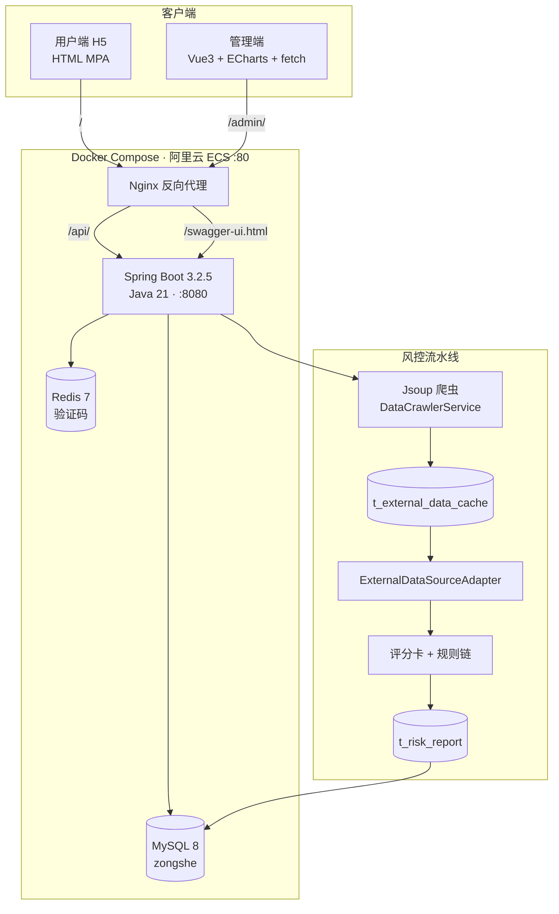

**文生图 Prompt（可选）：**

```
Professional software architecture diagram, flat vector style, white background, 
personal loan risk control system, left side mobile H5 and web admin clients, 
center Nginx gateway, right Spring Boot monolith connecting MySQL Redis, 
bottom data crawler pipeline to risk scoring engine, blue and teal color scheme, 
Chinese labels, clean lines, academic report quality, no watermark, 16:9
```

---

### 图 1-2 多数据源融合数据流

**插入位置：** P1「四层结构」段之后

**关键词：**  
`multi-source data fusion` `adapter pattern` `feature snapshot` `Jsoup HTML parser` `external data cache` `ETL pipeline`

**详细内容：**  
演示 HTML（demo-credit.html、demo-telecom.html）→ Jsoup 解析表格 → 按身份证/手机末位 0～9 写入 t_external_data_cache（SUFFIX_0～9）→ MockCreditBureauAdapter / MockTelecomAdapter 读取 → FeatureContextService 合并库内字段为 FeatureSnapshot → SimpleScoringCardEngine + 规则链 → t_risk_report。侧边标注定时任务与 POST /api/admin/crawler/run。

**Mermaid 代码：**

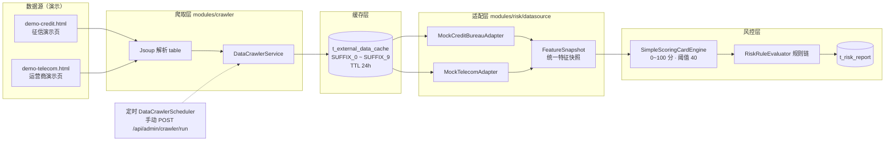

---

### 图 1-3 风控评估流程

**插入位置：** P2「双层结构」段之后

**关键词：**  
`scoring card` `rule chain` `risk assessment workflow` `explainable AI` `loan underwriting`

**详细内容：**  
用户 POST submit 申请 → 读取 User 信用分 + FeatureSnapshot 外部特征 → 评分卡四维度分箱计分（credit_score / loan_amount / overdue / online_months）→ 规则链顺序执行（BasicRisk → ScoringCard → ExternalData）→ 写入 RiskReport（riskScore、scoringCardPoints、passed、rejectReason、breakdown）→ 管理端/用户端只读展示。

**Mermaid 代码：**

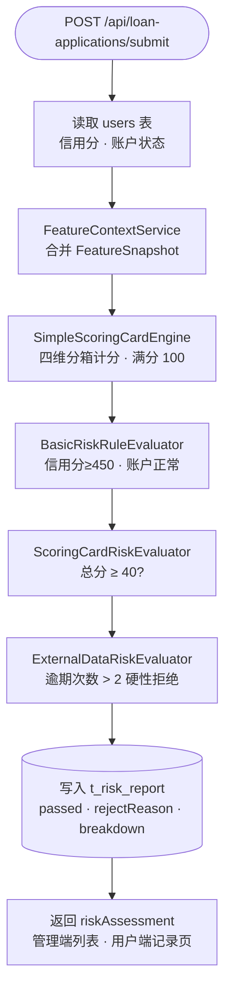

**时序图（备选，更细）：**

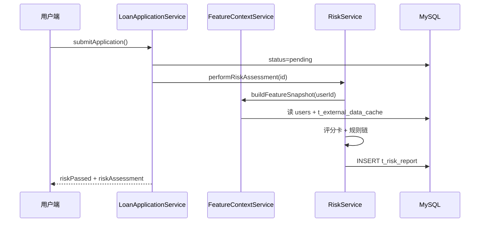

---

### 图 1-4 贷款申请状态机

**插入位置：** P4「状态流转设计」段之后

**关键词：**  
`state machine` `loan lifecycle` `approval workflow` `disbursement` `repayment plan`

**详细内容：**  
pending（提交+风控）→ approved（审批通过，此时生成合同+还款计划）或 rejected；approved → 合同签署 → disbursed（放款，幂等校验）；disbursed → SETTLED（结清）。标注副作用：approve 时 ensureRepayPlansForApplication；disburse 时 existsByContractAndDisburseStatus 防重复。

**Mermaid 代码：**

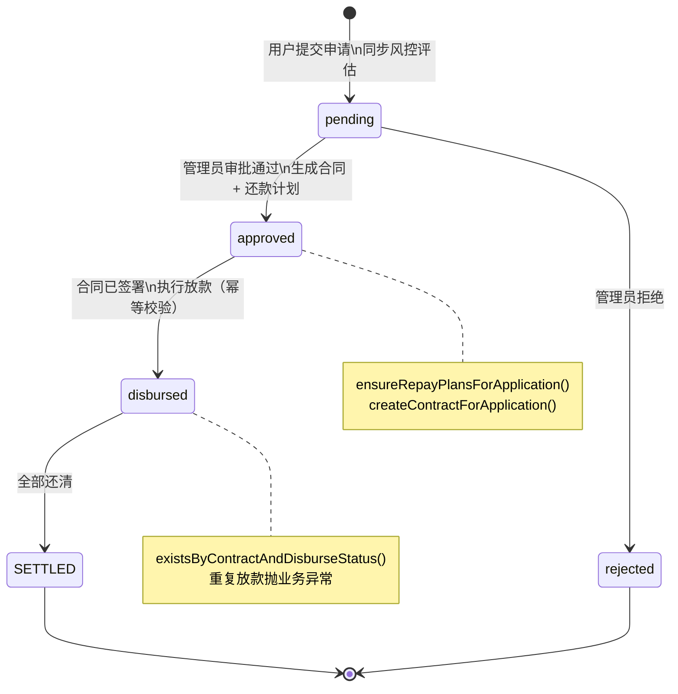

---

### 图 1-5 云端部署架构（Nginx 同源）

**插入位置：** P5「部署架构」段之后

**关键词：**  
`Docker Compose` `Nginx reverse proxy` `same-origin deployment` `Aliyun ECS` `container orchestration`

**详细内容：**  
四容器 mysql / redis / backend / web；仅 web 暴露 80 端口；Nginx 路径：/ → H5，/admin/ → Vue dist，/api/ → backend:8080，/swagger-ui.html 等单独反代；.env 注入密钥；部署目录 /opt/zongshe/deploy。

**Mermaid 代码：**

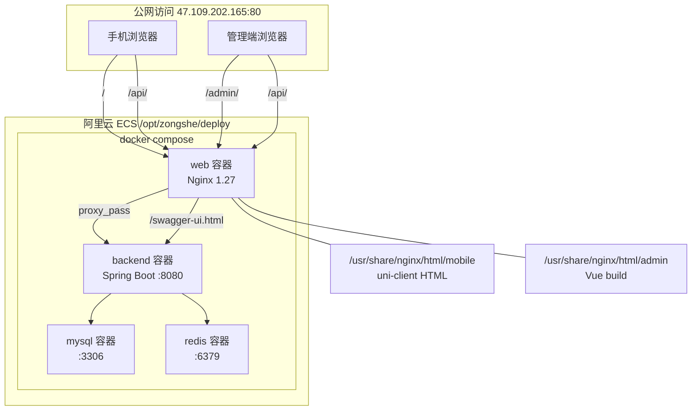

**Nginx 路径分流（可单独作小图）：**

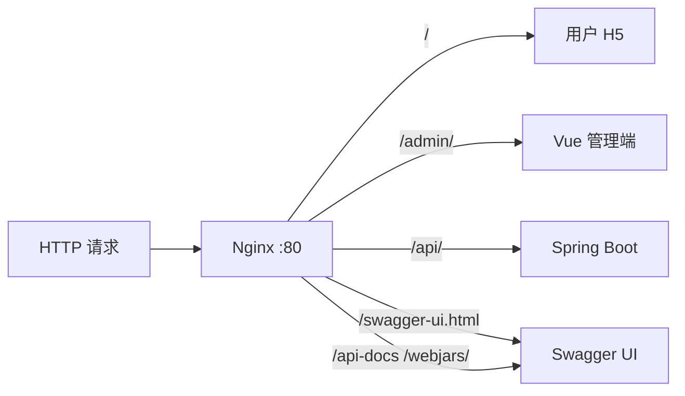

---

### 图 1-6 风控触发时机方案对比

**插入位置：** 1.2 节 P3 比选段之后

**关键词：**  
`design trade-off` `risk assessment timing` `before vs after comparison`

**详细内容：**  
方案 A：管理员打开审批页才评估 → 列表长期「未评估」。方案 B：用户 submit 时同步评估 → 三端数据一致。**选用 B**。

**Mermaid 代码：**

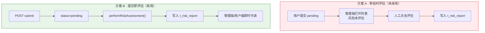

---

### 图 1-7 还款计划生成时机调整

**插入位置：** 1.2 节 P4 推理段之后

**关键词：**  
`bug fix` `repayment plan generation` `business rule correction`

**详细内容：**  
早期：submit 时生成计划 → 用户端还款页出现未审批贷款账单（错误）。调整后：仅在 approveApplication() 中 ensureRepayPlansForApplication()；查询层 JPQL 过滤贷款状态。

**Mermaid 代码：**

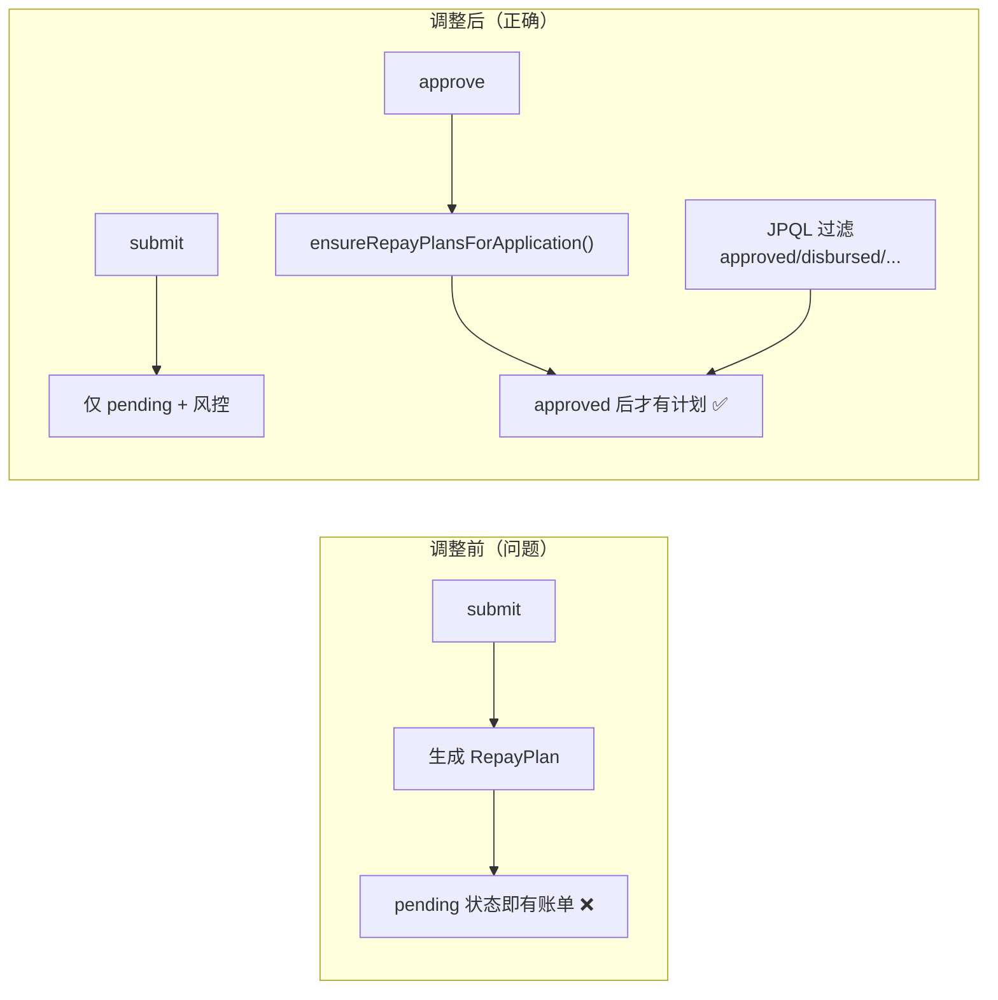

---

## 第一章 1.3 方案实现

### 图 1-8 风控相关数据表 ER 关系

**插入位置：** P1/P2 实现概述之后

**关键词：**  
`entity relationship diagram` `MySQL schema` `risk report` `loan application`

**详细内容：**  
users 1:N loan_applications；loan_applications 1:1 t_risk_report；users 与 t_external_data_cache 通过 id_suffix/phone_suffix 逻辑关联；loan_applications 1:N t_repay_plan / repay_plans；t_contract、t_disburse_record 关联审批放款链。

**Mermaid 代码：**

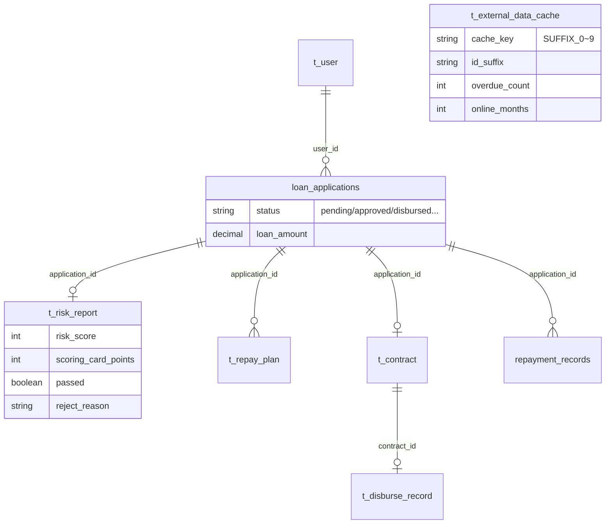

---

### 图 1-9 管理端贷款列表风控展示

**插入位置：** P2 实现 / 管理端联动段之后

**类型：** **真实截图**（不建议 AI 生成）

**关键词：**  
`admin dashboard screenshot` `loan management` `risk score column`

**截图指引：**
1. 浏览器打开 `http://47.109.202.165/admin/`，管理员登录（yunizai）
2. 进入「贷款申请管理」列表
3. 截取含列：**申请人、金额、状态、风控通过/未通过、评分卡分数、拒绝原因** 的整屏
4. 确保至少一条记录显示风控结果

**文生图 Prompt（仅 PPT 装饰，勿用于正式报告造假）：**

```
Clean web admin dashboard mockup, loan application table, columns for risk score 
and approval status, Chinese UI, light theme, realistic but generic, no real data
```

---

### 图 1-10 云服务器容器运行状态

**插入位置：** P5 实现 / 项目完成情况部署段

**类型：** **终端截图**

**截图指引：**

```bash
ssh root@47.109.202.165
cd /opt/zongshe/deploy
docker compose ps
```

截取四容器均为 **running** 或 **healthy** 的输出。可选追加 `docker compose logs backend --tail 15` 显示 Started 日志。

---

### 图 1-11 Swagger 接口文档

**插入位置：** P5 访问地址列表之后

**类型：** **浏览器截图**

**截图指引：**
1. 打开 `http://47.109.202.165/swagger-ui.html`（**不要**用 /api/swagger-ui.html）
2. 展开 `/api/loan-applications/submit` 或 `/api/risk` 相关接口
3. 截取左侧 API 分组 + 右侧接口详情

---

### 图 1-12 管理端统计图表

**插入位置：** P6 统计口径实现段之后

**类型：** **浏览器截图**

**截图指引：**
1. 管理端「控制台」页
2. 截取：申请趋势折线、状态分布、**月度还款柱图**（1 月～当前月）
3. 确保图表数据与后端 statistics 接口一致

---

## 项目完成情况与后续改进计划

### 图 2-1 三端同源访问示意

**插入位置：** 完成情况「部署方面」段之后

**关键词：**  
`same origin policy` `mobile H5 API` `CORS free deployment`

**详细内容：**  
手机与 PC 均访问同一 IP；H5 通过 api-config.js 取 location.origin；请求 /api/... 无跨域；管理端 VITE_BASE=/admin/。

**Mermaid 代码：**

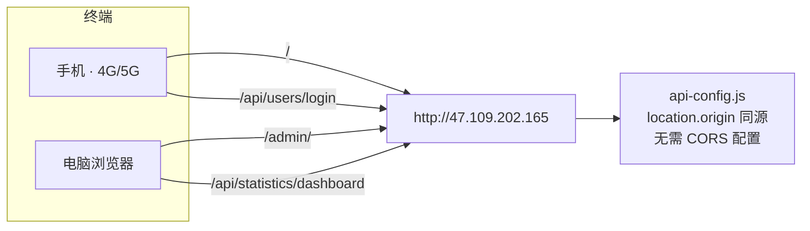

---

### 图 2-2 完整业务演示流程

**插入位置：** 阶段小结之前

**关键词：**  
`end-to-end demo flow` `loan origination` `答辩演示路径`

**Mermaid 代码：**

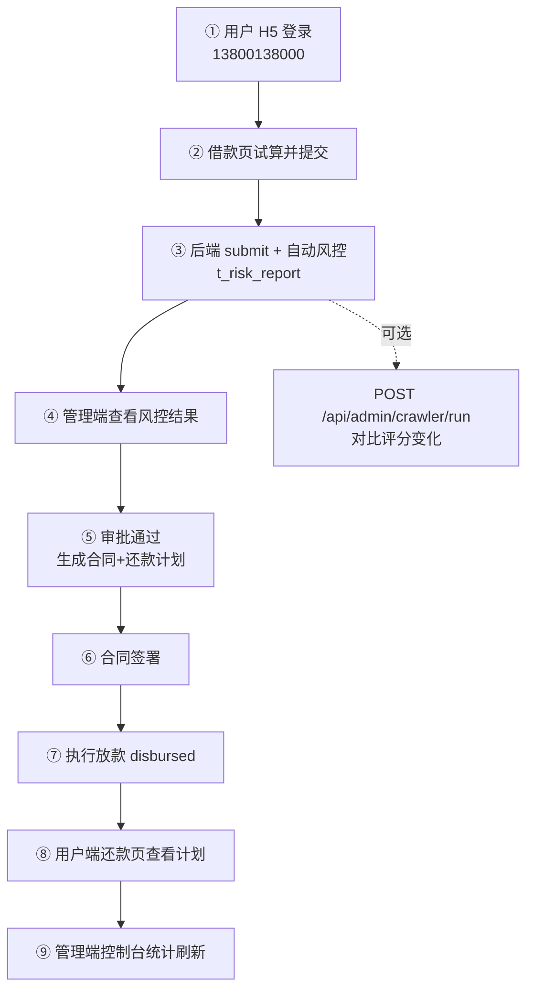

---

## 第二章 系统测试

### 图 3-1 单元测试执行结果

**类型：** **终端/IDE 截图**

**截图指引：**

```bash
cd d:\ZongShe2\backend
mvn test
```

截取末尾 **BUILD SUCCESS** 及 Tests run: 13, Failures: 0。或在 IDEA 中截取 5 个 Test 类全绿。

---

### 图 3-2 风控测试数据表（Navicat）

**类型：** **数据库客户端截图**

**截图指引：**
1. Navicat 连接云 MySQL（zongshe 库）
2. 打开 **t_risk_report**，显示 risk_score、scoring_card_points、passed
3. 同屏或分屏展示 **t_external_data_cache** 的 SUFFIX_* 与 overdue_count

---

### 图 3-3 测试体系分层架构

**插入位置：** 第二章后端测试支撑说明开头

**关键词：**  
`testing pyramid` `JUnit Mockito` `RC TC test cases`

**Mermaid 代码：**

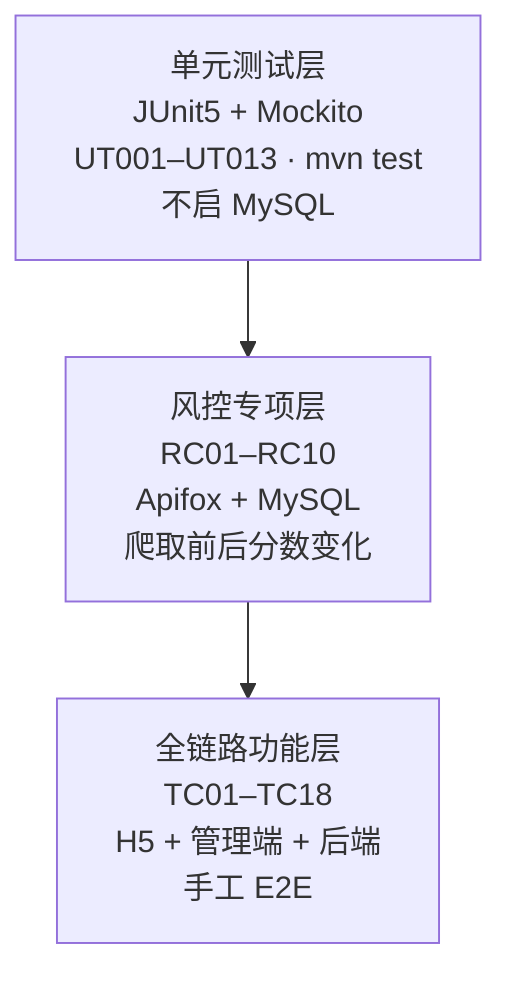

---

## 第三章 知识技能

### 图 4-1 deploy 目录与部署流程

**插入位置：** （六）容器部署与运维段之后

**Mermaid 代码（目录树 + 流程）：**

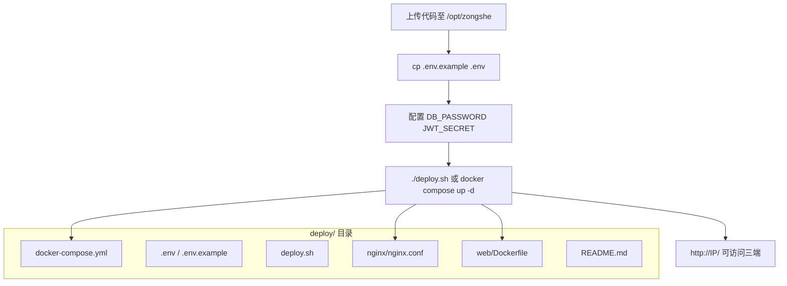

---

## 第四章 分工协作

### 图 5-1 后端联调与云部署协作示意

**插入位置：** 分工内容或协作方式段之后

**关键词：**  
`team collaboration` `API contract` `Swagger` `cross-functional`

**Mermaid 代码：**

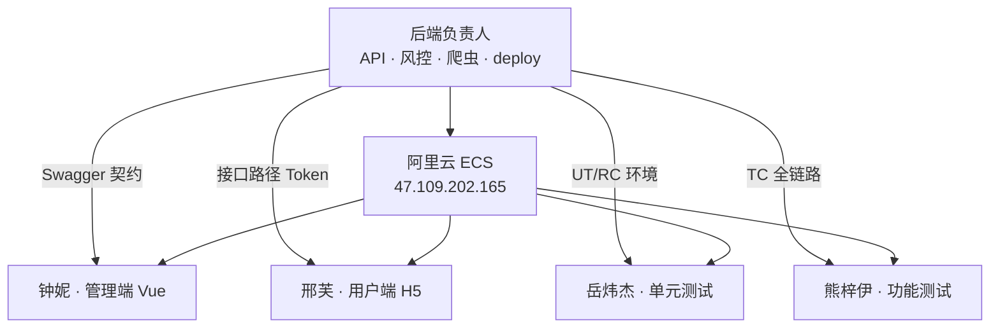

---

## 批量导出步骤（推荐）

1. 打开 https://mermaid.live  
2. 粘贴对应 **Mermaid 代码**  
3. **Configuration** → Theme: `neutral` 或 `default`  
4. **Actions → Export PNG**（Word 用 300dpi 左右；宽度建议 1400px）  
5. 文件命名：`图1-1-系统总体架构.png` … 便于插入 Word  

**Gamma / Napkin / ProcessOn：** 可将 Mermaid 代码粘贴后自动美化，或在 ProcessOn 选手绘风格导出。

---

## 图号与报告章节对照表

| 图号 | 标题 | 报告章节 | 生成方式 |
|------|------|----------|----------|
| 1-1 | 系统总体架构 | 1.1 开篇 | Mermaid |
| 1-2 | 多数据源融合数据流 | 1.1 P1 | Mermaid |
| 1-3 | 风控评估流程 | 1.1 P2 | Mermaid |
| 1-4 | 贷款申请状态机 | 1.1 P4 | Mermaid |
| 1-5 | 云端部署架构 | 1.1 P5 | Mermaid |
| 1-6 | 风控触发时机对比 | 1.2 P3 | Mermaid |
| 1-7 | 还款计划时机调整 | 1.2 P4 | Mermaid |
| 1-8 | 风控相关 ER 图 | 1.3 P1/P2 | Mermaid |
| 1-9 | 管理端风控列表 | 1.3 | 截图 |
| 1-10 | docker compose ps | 1.3 P5 | 截图 |
| 1-11 | Swagger 文档 | 1.3 P5 | 截图 |
| 1-12 | 管理端统计图表 | 1.3 P6 | 截图 |
| 2-1 | 三端同源访问 | 完成情况 | Mermaid |
| 2-2 | 完整演示流程 | 完成情况 | Mermaid |
| 3-1 | mvn test 结果 | 第二章 | 截图 |
| 3-2 | Navicat 数据表 | 第二章 | 截图 |
| 3-3 | 测试分层架构 | 第二章 | Mermaid |
| 4-1 | deploy 部署流程 | 第三章 | Mermaid |
| 5-1 | 分工协作示意 | 第四章 | Mermaid |

**建议答辩 Word 正文至少插入：** 1-1、1-2、1-4、1-5、2-2、3-1（6 张）；其余按页数酌情增加。

---

*生成后请将 IP、账号等替换为你们答辩现场实际值。*
