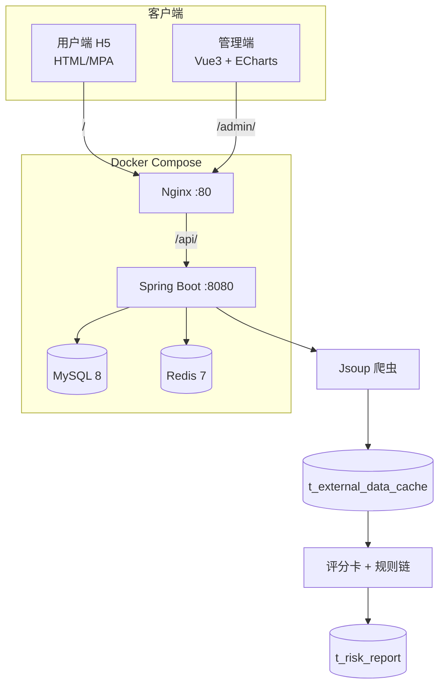
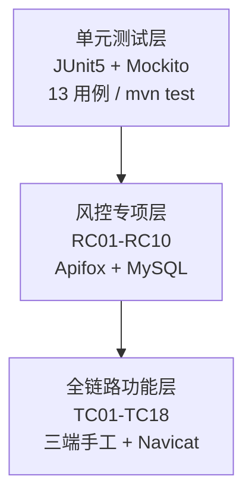

# 综设 II 答辩 PPT · 逐页具体内容

> 可直接复制到 PowerPoint / WPS / Gamma，或作为 AI 二次润色的底稿。  
> 建议总时长 **18 分钟汇报 + 5 分钟 Q&A**，共 **26 页**。  
> 请将 `[姓名]`、`[指导教师]`、`47.109.202.165` 等替换为真实信息。

---

## 第 1 页｜封面

**标题：** 多数据源融合的互联网个人贷款风控系统  
**副标题：** 软件工程综合设计 II · 总结答辩  
**信息：** 指导教师：[指导教师]  
**组员：** [后端姓名]、钟妮、邢芙、岳炜杰、熊梓伊  
**日期：** 2026 年 6 月

**演讲备注（15 秒）：**  
各位老师好，我们小组汇报的题目是《多数据源融合的互联网个人贷款风控系统》，系统已实现用户借款、管理审批、评分卡风控、数据爬取融合和 Docker 云部署，下面分模块介绍。

---

## 第 2 页｜目录

1. 课题背景与目标  
2. 需求与总体架构  
3. 后端：多源融合与评分卡风控  
4. 管理端与用户端实现  
5. 测试体系与结果  
6. 部署与现场演示  
7. 总结与 Q&A  

**演讲备注（10 秒）：** 按「问题—方案—实现—验证—演示」顺序汇报。

---

## 第 3 页｜课题背景与意义

**要点：**
- 互联网个人贷款业务增长快，**贷前风控**是核心环节
- 真实风控需融合：用户信用、征信、运营商等多源数据
- 课程要求：完整业务链 + **评分卡机制** + **数据爬取** + 多端协同
- 本项目目标：构建可演示、可解释、可部署的个贷风控原型系统

**演讲备注（40 秒）：**  
传统个贷系统若只用库内信用分，无法体现「多数据源融合」。我们设计了一套可扩展架构：演示环境用 HTML 爬取模拟外部征信/运营商，生产环境可替换为真实 API；风控采用评分卡 + 规则链，便于答辩解释「为什么通过/拒绝」。

---

## 第 4 页｜需求分析概要

| 角色 | 核心需求 |
|------|----------|
| **借款用户** | 注册登录、查额度、提交申请、看进度、还款 |
| **管理员** | 看统计、审贷款、看风控、管合同/产品 |
| **系统** | 自动风控、外部数据融合、状态一致、安全认证 |

**非功能需求：** JWT 鉴权、Docker 部署、Swagger 文档、单元测试覆盖核心 Service

**演讲备注（35 秒）：**  
需求来自综设 I 和任务书。实现上拆成三条线：用户 H5、管理 Web、Spring Boot 后端，接口在 Swagger 里对齐。上线后三端都走同一个 IP，Nginx 按路径分发，手机浏览器里不用写死后端地址。

---

## 第 5 页｜总体架构（必画）



**访问地址：**
- 用户端：`http://47.109.202.165/`
- 管理端：`http://47.109.202.165/admin/`
- API/Swagger：`/api/`、`/swagger-ui.html`

**演讲备注（50 秒）：**  
架构是前后端分离 + 单体 Spring Boot。Nginx 把 H5、管理端、API 放在同一域名下，解决跨域。Redis 主要用于短信验证码；业务数据在 MySQL。爬虫模块独立，结果进缓存表，再被风控适配器读取。

---

## 第 6 页｜技术栈（准确版，勿写错）

| 层次 | 技术 | 说明 |
|------|------|------|
| 后端 | Java 21 + Spring Boot 3.2.5 | JPA、Security、定时任务 |
| 安全 | JWT + BCrypt | 双端 Bearer Token |
| 数据 | MySQL 8 + Redis 7 | 持久化 + 验证码 |
| 爬虫 | Jsoup 1.17 | 解析演示 HTML 表格 |
| 管理端 | **Vue 3 + Vite + ECharts + fetch** | 无 Element Plus / Axios |
| 用户端 | **HTML5 + CSS3 + ES6+ MPA** | main-home.html 等，首页功能网格 |
| 部署 | Docker Compose + Nginx | 四容器一键启动 |

**演讲备注（30 秒）：** 答辩以 **H5 用户端 + Vue 管理端** 为主；uni-app 源码为扩展，云上演示走 Nginx 静态 H5。

---

## 第 7 页｜后端模块划分

| 模块 | 包路径 | 职责 |
|------|--------|------|
| 用户认证 | `modules/user`、`modules/auth` | 注册/登录/验证码 |
| 贷款申请 | `modules/loanapplication` | 提交、审批、列表 |
| 风控 | `modules/risk` | 评分卡、规则链、报告 |
| 爬虫 | `modules/crawler` | 爬取、缓存、定时任务 |
| 还款 | `modules/repay` | 计划、还款、逾期 |
| 合同 | `service/ContractService` | 生成、签署、放款 |
| 统计 | `modules/statistics` | 控制台图表数据 |

**核心 API 前缀：** `/api/users`、`/api/loan-applications`、`/api/risk`、`/api/repayment`、`/api/admin/*`

**演讲备注（40 秒）：** [后端姓名] 负责。按业务域分包，Controller 轻薄，状态机和计分都在 Service，方便单元测试。

---

## 第 8 页｜多数据源融合（课题核心 · 必讲）

**工程问题：** 风控不能只用库内信用分，还要融合征信、运营商特征。

**数据流（逐步）：**

```
demo-credit.html / demo-telecom.html
        ↓ Jsoup 解析 table
t_external_data_cache（按身份证/手机末位 SUFFIX_0~9）
        ↓ MockCreditBureauAdapter / MockTelecomAdapter
FeatureSnapshot（统一特征快照）
        ↓ SimpleScoringCardEngine + 规则链
t_risk_report（riskScore、scoringCardPoints、passed）
```

**触发方式：**
- 定时：`DataCrawlerScheduler`（约每 6 小时）
- 手动：`POST /api/admin/crawler/run`（答辩演示用）

**创新点：** 适配器模式 — 换真实征信 API 只需新增 Adapter，不改评分卡核心代码。

**演讲备注（60 秒）：**  
这是课题名称里「多数据源融合」的落地。演示页在 `backend/src/main/resources/crawler/`，爬取后按身份证末位匹配，例如尾号 9 对应 overdue=3。适配器优先读缓存，无缓存时算法兜底，保证没爬取也能跑通。

---

## 第 9 页｜评分卡规则（可解释 · 可答辩）

**引擎：** `SimpleScoringCardEngine`，满分 100，**通过线 40 分**（可配置）

| 维度 | 分箱规则 | 分值示例 |
|------|----------|----------|
| 信用分 credit_score | ≥700 / ≥600 / ≥500 / 其他 | 50 / 35 / 20 / 5 |
| 贷款金额 loan_amount | ≤5万 / ≤20万 / 更高 | 30 / 20 / 10 |
| 征信逾期 credit_overdue_count | 0 次 / ≤2 次 / >2 次 | +10 / 0 / **−20** |
| 运营商在网 telecom_online_months | ≥24月 / ≥12月 / 其他 | +10 / +5 / 0 |

**规则链补充（硬性拒绝）：**
- 信用分 < 450 → 基础规则直接拒绝  
- 逾期次数 > 2（阈值 2）→ 外部数据规则拒绝  

**演讲备注（55 秒）：**  
答辩时可举例：信用分 500 得 20 分，贷款 3 万得 30 分，合计 50 分通过；若身份证尾号 9 爬取后 overdue=3，扣 20 分，可能降到 30 分不通过。这就是 RC-06「爬取前后分数变化」演示原理。

---

## 第 10 页｜风控触发与业务状态机

**设计决策 1：提交即风控**
- 用户 `POST /api/loan-applications/submit` 保存后立即 `performRiskAssessment()`
- 管理端审批页可直接看到 `riskPassed`、`scoringCardPoints`、`rejectReason`

**设计决策 2：审批通过才生成还款计划**
- 避免「未审批就有待还账单」
- 查询层只返回 `approved/disbursed/settled/paid` 贷款的计划

**状态机：**

```
pending ──审批通过──► approved ──签署──► SIGNED ──放款──► disbursed ──还清──► SETTLED
   │                                                                              
   └──审批拒绝──► rejected                                                          
```

**演讲备注（50 秒）：**  
这两条是联调中踩坑后定的：早期提交就生成还款计划，用户端还款页出现未审批贷款；后来改到审批后生成，并在 JPQL 里过滤贷款状态。

---

## 第 11 页｜核心 API 一览（联调/答辩用）

| 场景 | 方法与路径 |
|------|------------|
| 用户登录 | `POST /api/users/login` |
| 提交贷款 | `POST /api/loan-applications/submit` |
| 查风控 | `GET /api/risk/applications/{id}/assessment` |
| 重算风控 | `POST /api/risk/applications/{id}/assess` |
| 管理员审批 | `PUT /api/loan-applications/{id}/approve` |
| 触发爬取 | `POST /api/admin/crawler/run` |
| 合同放款 | `POST /api/admin/contracts/{id}/disburse` |
| 用户还款 | `POST /api/repayment/pay` |
| 控制台统计 | `GET /api/statistics/charts` |

**演讲备注（30 秒）：** Swagger 在 `/swagger-ui.html`，答辩备用 curl 调爬取和 assess。

---

## 第 12 页｜管理端实现（钟妮）

**技术：** Vue 3 + ECharts + fetch，单页 Dashboard

**功能模块：**
- **登录：** `/admin/`，账号 `yunizai`，密码读服务器 `.env` 的 `ADMIN_PASSWORD`
- **控制台：** 申请数量、审批状态饼图、月度还款柱图（对接真实 `/api/statistics/charts`）
- **贷款管理：** 列表含风控列（通过/未通过、评分卡分数）；支持通过/拒绝，风控未通过时有二次确认
- **合同管理：** 生成 → 签署 → 放款，状态标签展示
- **产品管理：** 贷款产品 CRUD

**演讲备注（钟妮讲，50 秒）：**  
强调 ECharts 数据来自后端真实统计，不是写死假数据。审批时同屏看风控结果再决定，体现「人机结合」。

---

## 第 13 页｜用户端实现（邢芙）

**技术：** 原生 HTML MPA，Nginx 根路径 `/`

**主要页面：**
| 页面 | 功能 |
|------|------|
| login-prototype.html | 密码/验证码登录 |
| main-home.html | 可借额度、功能菜单（还款/额度/资料/借款记录） |
| loan-home.html | 金额、期限、还款方式、**实时还款计算器** |
| loan-records.html | 申请列表、进度条、风控结果、状态中文 |
| repay.html | 待还计划（全额/部分）、还款记录筛选 |
| credit-limit.html | 信誉分环形图、增信提额 |

**演示账号：** 13800138000 / 123456  
**退出登录：** `http://IP/?logout=1`

**演讲备注（邢芙讲，50 秒）：**  
用户端是功能网格 + 页面跳转，不是 SPA 底部 Tab。借款页调整金额时实时算月供，帮助用户决策；还款需跳转确认页，降低误操作。

---

## 第 14 页｜测试体系三层架构（岳炜杰 + 熊梓伊）



| 层级 | 环境 | 用例 | 结果 |
|------|------|------|------|
| 单元测试 | 无 MySQL | UT001–UT013 | **13/13 通过** |
| 风控专项 | 后端 + MySQL | RC01–RC10 | 设计完成，实操通过 |
| 功能测试 | 三端 + MySQL | TC01–TC18 | 主链路通过 |

**演讲备注（岳炜杰 40 秒 + 熊梓伊 30 秒）：**  
单元测试用 Mockito 隔离数据库，提前发现跨用户签署、未审批生成合同等问题。RC-06 验证爬取后分数变化；TC-17 走完整 E2E。

---

## 第 15 页｜单元测试明细（岳炜杰）

| 编号 | 模块 | 场景 | 结论 |
|------|------|------|------|
| UT001–006 | 合同服务 | 生成/签署/跨用户拦截/重复放款 | 通过 |
| UT007–008 | 贷款申请 | 审批生成合同；拒绝不生成 | 通过 |
| UT009–010 | 风控评估 | 低信用分拦截；逾期扣分 | 通过 |
| UT011–012 | 评分引擎 | 四维累加；在网加分 | 通过 |
| UT013 | 数据爬虫 | HTML 解析入库 | 通过 |

**执行：** `cd backend && mvn test` → **BUILD SUCCESS**

**演讲备注（25 秒）：** 可展示 Maven 控制台截图或 IDEA 绿色对勾。

---

## 第 16 页｜风控专项示例 RC-06（熊梓伊）

**场景：** 爬取前后风控分数变化

**步骤：**
1. 用户身份证尾号 **9** 提交贷款 → 首次评估可能 **50 分通过**（无缓存时）
2. 管理员执行 `POST /api/admin/crawler/run` → 写入 overdue=3
3. 执行 `POST /api/risk/applications/{id}/assess` **重算**
4. 评分卡逾期维 **−20** → 总分可能 **30 分拒绝**

**验证：** Apifox 看 JSON + Navicat 查 `t_risk_report`、`t_external_data_cache`

**演讲备注（40 秒）：** 体现「多数据源融合」对风控结果的影响，是答辩高分点。

---

## 第 17 页｜Docker 部署方案（[后端姓名]）

**Compose 四服务：** mysql、redis、backend、web(nginx)

**目录：** `/opt/zongshe/deploy`

**关键命令：**
```bash
cd /opt/zongshe/deploy
docker compose up -d --build
docker compose ps
docker compose logs backend --tail 30
```

**注意：** `.env` 中 `DB_PASSWORD` 与 MySQL 一致；改 `.env` 需 `--force-recreate backend`

**演讲备注（35 秒）：** 云服务器 47.109.202.165 已部署。backend 构建慢可用本机 JAR + Dockerfile.prebuilt。

---

## 第 18 页｜创新点与工程难点

**创新点：**
1. 爬取 + 缓存 + 适配器 + 特征快照，仿真生产多源融合  
2. 评分卡四维度可解释，管理端同屏展示分项  
3. Nginx 同源三端，手机浏览器即演示  
4. 三层测试分工，13 条 UT 提前拦截底层缺陷  

**工程难点与解决：**
| 难点 | 解决 |
|------|------|
| 云主机 Maven 构建失败 | settings.xml 阿里云镜像 + prebuilt JAR |
| 管理端「未评估」 | backfillRiskReports + 提交即风控 |
| 未审批出现还款计划 | 审批后生成 + 查询过滤 |
| 统计未来月虚假数据 | 按 repayTime 归集 + 过滤未来月 |

**演讲备注（40 秒）：** 诚实说明演示数据与生产 API 差距，强调架构可扩展。

---

## 第 19 页｜存在问题与后续改进

- 爬取源为演示 HTML，非真实征信接口  
- 管理端暂无「一键爬取」按钮（可用 Swagger/curl）  
- 部分 H5 页面（人脸/银行卡）为演示 UI  
- Redis 尚未用于业务缓存，仅验证码  
- uni-app APK 需 HBuilderX 云打包  

**演讲备注（25 秒）：** 说明 v1 范围与 v2 方向，体现工程思维。

---

## 第 20 页｜现场演示脚本（8–10 分钟，可单独一人操作）

| 步骤 | 操作 | 讲解词（简） |
|------|------|--------------|
| 1 | 手机打开 `http://IP/`，必要时 `?logout=1` | 用户端 H5，同源 API |
| 2 | 登录 13800138000 / 123456 | JWT 登录态 |
| 3 | 借款页提交一笔申请（如 3500/6期） | 提交即触发风控 |
| 4 | 借款记录页看状态、风控分 | 进度条 + 风控结果 |
| 5 | 管理端登录，贷款管理找到该笔 | 同屏看 riskPassed、评分卡 |
| 6 | Swagger/curl 触发爬取 | 多源数据入库 |
| 7 | assess 重算或看尾号 9 用户对比 | 融合前后分数变化 |
| 8 | 管理端审批通过 → 合同签署 → 放款 | 状态 approved → disbursed |
| 9 | 用户端还款页出现待还计划 | 审批后才有计划 |
| 10 | 控制台看统计图表 | 真实 API 驱动 ECharts |

**演讲备注：** 演示前 `docker compose ps` 确认四容器 Up；准备备用热点或本地录屏。

---

## 第 21 页｜分工协作

| 成员 | 职责 | 答辩段落 |
|------|------|----------|
| [后端姓名] | 架构、后端、风控/爬虫、部署 | 架构、风控、部署 |
| 钟妮 | Vue3 管理端 | 管理端 |
| 邢芙 | H5 用户端 | 用户端 |
| 岳炜杰 | 单元测试 | UT 与三层设计 |
| 熊梓伊 | RC/TC 测试 | 专项与全链路 |

**协作：** Swagger 定接口；问题用 JSON + 数据库截图定位；Git 分支协作。

**演讲备注（20 秒）：** 每人 1 分钟自述贡献即可。

---

## 第 22 页｜总结

- 完成 **多数据源融合 + 评分卡风控 + 全链路个贷** 原型系统  
- 三端部署可访问，主流程 **申请→风控→审批→放款→还款** 跑通  
- **13 条单元测试 100% 通过**，功能/风控测试覆盖主场景  
- 架构可扩展：适配器可换真实 API，评分卡规则可配置  

**演讲备注（25 秒）：** 感谢老师指导，请批评指正。

---

## 第 23 页｜致谢 & Q&A

**致谢：** 指导教师、[列出老师姓名]  
**Q&A**

---

# 附录 A：答辩常见问题与参考答案

**Q1：为什么用评分卡而不是机器学习？**  
A：课程样本量有限，评分卡可解释性强，答辩能讲清每一维加减分；规则链可叠加硬性拒绝，满足任务书「评分卡机制」要求。

**Q2：爬虫数据是否真实？**  
A：演示环境用 `demo-credit.html` 模拟征信页，Jsoup 解析入库；生产可替换 `ExternalDataSourceAdapter` 为真实 HTTP/SDK，FeatureSnapshot 层不变。

**Q3：风控什么时候触发？**  
A：用户提交申请时同步 `performRiskAssessment()`；爬取后可 `POST .../assess` 重算；历史演示数据启动时 `backfillRiskReports()` 补全。

**Q4：为什么审批通过才有还款计划？**  
A：业务状态机要求，避免未审批贷款出现在还款页；实现上 `approveApplication()` 调用 `ensureRepayPlansForApplication()`，查询 JPQL 过滤贷款状态。

**Q5：管理端和 user 端技术栈一样吗？**  
A：不一样。管理端 Vue3 SPA + ECharts；用户端原生 HTML MPA。共用同一套后端 JWT API。

**Q6：放款如何防止重复？**  
A：`disburseContract()` 查 `disburse_records` 是否已有成功记录，有则抛「该合同已放款」；**不是 Redis 分布式锁**。

**Q7：单元测试为什么不连数据库？**  
A：Mockito Mock Repository，只测 Service 业务逻辑，执行快、可 CI；集成测试用 RC/TC 补全。

**Q8：Redis 用来干什么？**  
A：当前主要用于短信验证码 TTL；Compose 已部署 Redis，业务缓存为后续扩展预留。

---

# 附录 B：演示前检查清单

- [ ] `docker compose ps` 四容器均为 Up  
- [ ] 浏览器能打开 `http://IP/` 和 `/admin/`  
- [ ] 用户 13800138000 能登录；管理端 yunizai 能登录  
- [ ] 如需干净登录态：访问 `/?logout=1`  
- [ ] Swagger 能打开；管理员 Token 已复制（调爬取用）  
- [ ] 准备身份证尾号 **9** 的测试用户或演示说明  
- [ ] 管理端控制台图表能加载（非空白）  
- [ ] 备用：录屏视频 + 本地 `mvn test` 截图  

---

# 附录 C：给 AI 的精简提示词（生成美化版 PPT 时用）

```
请把《综设II-答辩PPT-逐页内容.md》中第 1–23 页转化为 16:9 答辩 PPT：
- 金融科技风，主色 #7b5cf2，每页≤6 要点
- 第 5、8、14 页插入 Mermaid 架构/流程图
- 第 9 页用表格展示评分卡四维度
- 第 20 页用时间轴展示演示步骤
- 每页 Speaker Notes 保留文档中的演讲备注
- 不要出现 Element Plus、Axios、Redis 分布式锁、H5 底部四 Tab 等不准确描述
```

---

*文档路径：`docs/综设II-答辩PPT-逐页内容.md`*
